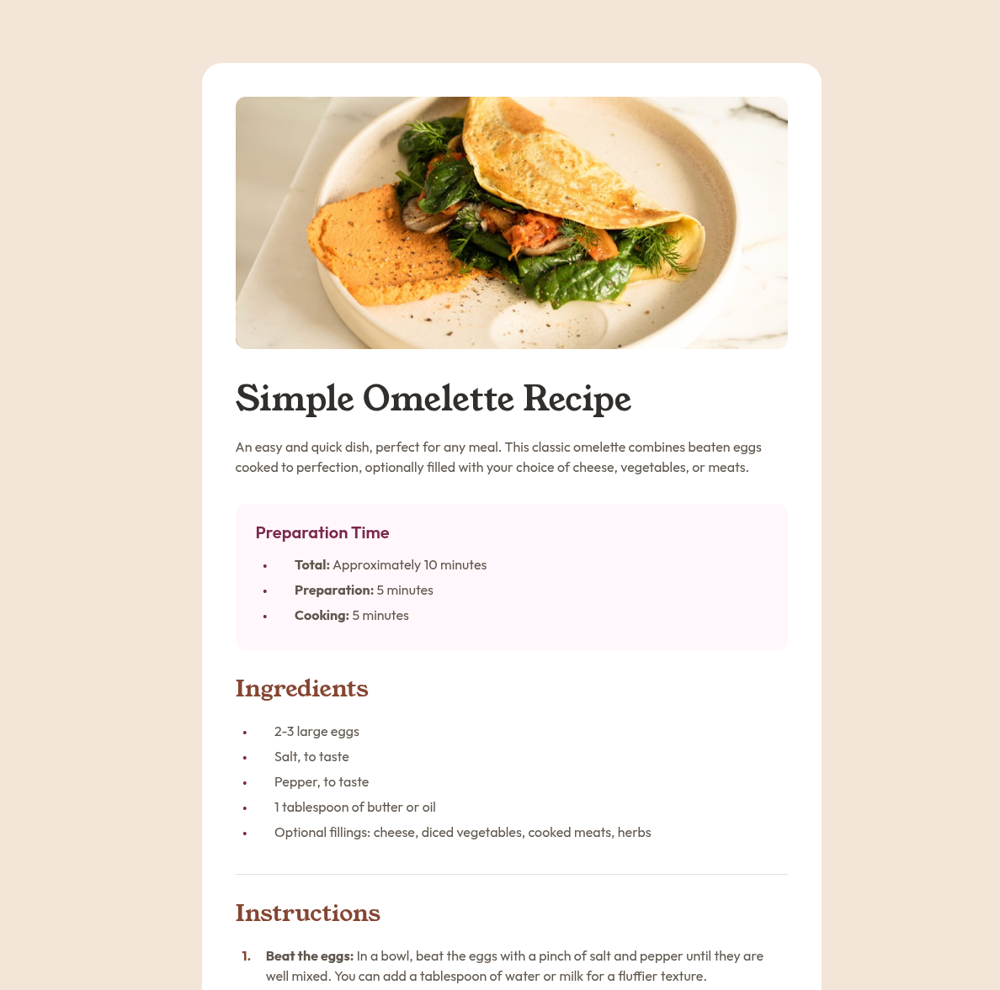

# Frontend Mentor - Recipe page solution

This is a solution to the [Recipe page challenge on Frontend Mentor](https://www.frontendmentor.io/challenges/recipe-page-KiTsR8QQKm). Frontend Mentor challenges help you improve your coding skills by building realistic projects. 

## Table of contents

- [Overview](#overview)
  - [Screenshot](#screenshot)
  - [Links](#links)
- [My process](#my-process)
  - [Built with](#built-with)
  - [What I learned](#what-i-learned)
  - [Continued development](#continued-development)
- [Author](#author)

## Overview

### Screenshot



### Links

- Solution URL: [GitHub](https://github.com/ryanwells-rwc/recipe-page-main)
- Live Site URL: [Netlify](https://recipe-page-main-rwc.netlify.app)

## My process

### Built with

- Semantic HTML5 markup
- CSS custom properties
- Flexbox
- Mobile-first workflow

### What I learned

In this challenge, I learned about image placement and how to style lists. 

To see how you can add code snippets, see below:

```css
.card img {
  width: calc(100% + var(--size-400) * 2);
  margin-left: calc(var(--size-400) * -1);
  margin-right: calc(var(--size-400) * -1);
  margin-bottom: var(--size-500);
  object-fit: cover;
}

.preparation-container li::before, .ingredients-container li::before {
  content: "•";
  font-size: var(--size-250);
  color: var(--c-rose-800);
  display: table-cell;
  vertical-align: middle;
  padding-right: var(--size-400);
}
```

### Continued development

In the future, I would like to get more comfortable with centering and 
fitting images in containers and dealing with margins and padding in a more efficient way.

## Author

- Website - [Ryan Wells](https://ryanwells.io)
- Frontend Mentor - [@ryanwells-rwc](https://www.frontendmentor.io/profile/ryanwells-rwc)
